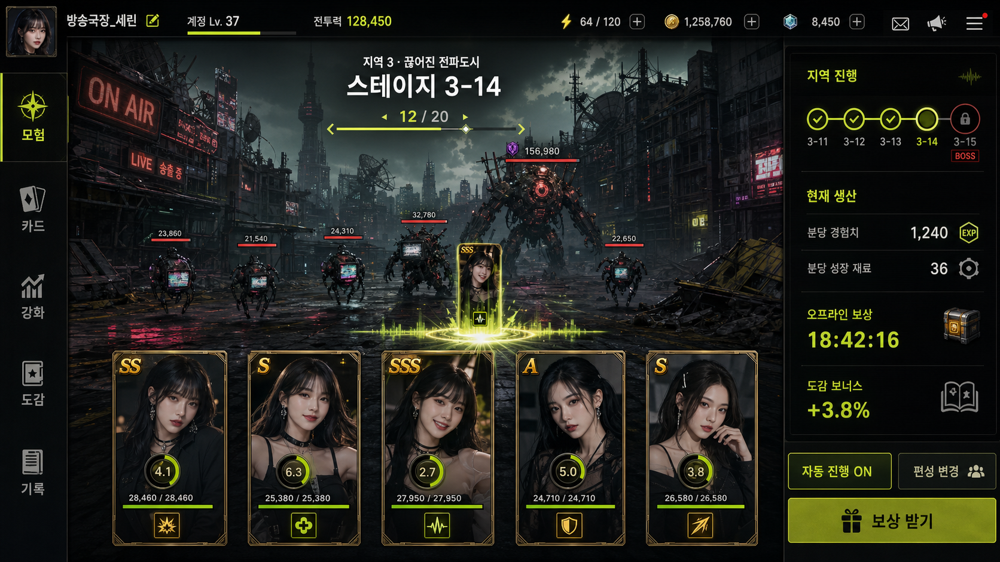

# 리뉴얼 기획안 2: 방치형 카드 RPG

> 2026-07-16 개편본. 승인된 메인 화면 콘셉트를 기준으로 다시 작성했다.
> 구현 전 검토용이며 사용자의 명시적 지시 전까지 커밋, push와 배포를 하지 않는다.

## 1. 게임 정의

기존 카드뽑기를 유지하고, 획득한 인물 카드를 5장 편성해 지역과 스테이지를 계속 돌파하는 방치형 RPG다.

- 메인 콘텐츠: 상시 자동 모험과 스테이지 진행
- 공동 콘텐츠: 정해진 시간에 열리는 서버 전체 월드보스
- 보조 콘텐츠: SOOP API 없이도 뽑기 포인트를 얻는 미니게임
- 수집 콘텐츠: 보유 카드 관리와 계정 영구 스탯을 제공하는 도감
- 성장 콘텐츠: 중복 카드를 사용하는 `9성` 강화
- 기존 SOOP 후원 연동: 유지
- 수익화, 유료 재화, 광고: 사용하지 않음

기획안 1의 `거대 악플러 레이드`와 `방치형 던전 파견`을 메인게임으로 확대한 구조가 아니다. 기획안 2의 중심은 별도 입장형 미니게임이 아니라 항상 진행되는 지역·스테이지 모험이다.

## 2. 디자인 기준



이 시안을 기획안 2의 디자인 기준으로 사용한다.

- 어두운 산업형 방송도시 배경
- 검정·그래파이트 기반, 라임 진행 표시, 금색 등급 강조
- 중앙은 패널로 가리지 않는 넓은 전장
- 기존 세로형 인물 카드 5장을 전투 유닛으로 직접 사용
- 카드가 공격할 때 중앙축을 따라 짧게 상승하고 공격 후 원위치
- 카드 크기와 비율은 항상 동일
- 카드 테두리는 얇게 유지하고 이미지 안으로 과도하게 침범하지 않음
- 별도 SD 캐릭터, MMORPG형 작은 유닛과 복잡한 스킬바는 사용하지 않음

## 3. 전체 화면 구조

### 공통 상단 바

상단에는 다음 정보만 상시 노출한다.

- 닉네임과 프로필 카드
- 현재 전투력
- 행동력
- 카드뽑기 포인트
- 우편함, 공지와 설정

상단에서 제거하는 항목:

- 골드
- 유료 보석
- 별도 레이드 재화
- 별도 던전 재화
- 여러 종류의 성장 화폐

강화 재료, EX 카드와 이벤트 물품은 공용 화폐가 아니라 해당 화면에서만 확인하는 보유 아이템으로 처리한다.

### 좌측 주 메뉴

최종 메뉴는 다음 일곱 개로 구성한다.

1. `모험`
2. `상점`
3. `강화`
4. `도감`
5. `월드보스`
6. `미니게임`
7. `랭킹`

기존 시안의 `카드` 메뉴는 제거한다. 보유 카드 목록과 상세 정보는 `도감`에 통합한다. 빈 메뉴 자리는 기존 카드팩을 구매하는 `상점`으로 변경한다.

### 카드와 도감 통합 원칙

`도감` 화면 하나에서 다음 기능을 모두 처리한다.

- 보유 카드 전체 목록
- 미보유 카드 실루엣
- 인물·종족·등급 필터
- 카드 상세 스탯과 패시브
- 카드 잠금과 대표 카드 설정
- 인물·종족·등급 컬렉션 진행도
- 적용 중인 계정 영구 보너스
- EX 전시 컬렉션

전투 편성 변경은 `모험` 화면의 `편성 변경`에서 바로 실행한다. 사용자가 편성을 바꾸기 위해 도감 메뉴를 거칠 필요는 없다.

## 4. 공용 재화

### 행동력

- 초기 최대치 후보: `120`
- 시간에 따라 자동 회복
- 메인 스테이지의 반복 자동전투에는 사용하지 않음
- 행동력이 없어도 현재 스테이지의 방치 보상은 계속 누적
- `빠른 전투`와 보상형 미니게임 입장에 사용
- 월드보스 기본 3회 도전에는 사용하지 않음

초기 사용안:

| 사용처 | 행동력 |
|---|---:|
| 빠른 전투 1회 | 20 |
| 보상형 미니게임 1회 | 10 |
| 미니게임 연습 | 0 |
| 월드보스 기본 도전 | 0 |

빠른 전투는 현재 스테이지 기준 방치 보상 2시간분을 즉시 받는 기능이다. 일일 사용 횟수는 제한한다.

### 카드뽑기 포인트

카드팩을 구매하는 유일한 공용 포인트다.

획득처:

- SOOP 후원 API 연동
- 미니게임 점수 보상
- 지역·보스 최초 클리어
- 월드보스 참여와 개인 피해 구간
- 운영 이벤트

사용처:

- 일반·정예·프리미엄 카드팩
- 저그·테란·프로토스 종족 카드팩
- 아이템 뽑기 `작전 지원 보급팩`
- `9성` 강화 시도에 필요한 추가 포인트

API 후원이 가장 빠른 획득 경로일 수는 있으나, 미니게임과 게임 플레이만으로도 카드팩을 계속 뽑을 수 있어야 한다.

## 5. 메인 화면: 모험

`모험`이 로그인 직후 보이는 기본 화면이다.

### 화면 구성

- 중앙 상단: 현재 지역명, 스테이지 번호와 웨이브 진행도
- 중앙 전장: 일반 적, 정예 적과 다음 보스
- 하단: 현재 편성 카드 5장
- 우측: 지역 진행도, 분당 생산량, 오프라인 보상과 도감 보너스
- 우측 하단: 자동 진행, 편성 변경과 보상 받기

### 진행 방식

1. 카드 5장이 현재 스테이지의 적을 자동 공격한다.
2. 일반 웨이브를 모두 처치하면 스테이지 보스가 등장한다.
3. 보스를 제한시간 안에 쓰러뜨리면 다음 스테이지로 이동한다.
4. 모험 작전 1회는 항상 `1-1`에서 시작하며 성공하는 동안 다음 스테이지로 연속 진행한다.
5. 작전에 실패하면 무한 반복하지 않고 해당 런을 종료한다.
6. 런 종료 시 이번 런에서 클리어한 깊이에 따라 카드뽑기 포인트와 편성 카드 EXP를 한 번에 지급한다.
7. 첫 런 시작 시각부터 4시간 동안 최대 3개 런을 시작할 수 있으며, 진행 중인 런을 일시 정지하거나 재개해도 횟수를 추가 차감하지 않는다.
8. 최고 도달 스테이지가 분당 생산량, 오프라인 보상과 EX 최초 클리어 보상을 결정한다.

### 난이도 기준

- 기존 카드게임보다 훨씬 느리고 어렵게 성장하도록 잡는다.
- 무강화 동일 등급 편성의 도달 기준은 F 3, E 5, D 8, C 10, B 11, A 18, S 24, SS 33, SSS 40단계다.
- D·E·F 중심 저등급 편성도 5장을 `9성`까지 강화하면 도감 보너스 없이 1지역 보스를 통과한다.
- 중급 이상 편성은 1지역을 빠르게 넘고 2지역부터 카드 등급·도감·강화 성장에 따라 벽을 만난다.
- 체력만 과도하게 늘리지 않고 적 공격력, 제한시간, 카드 경험치와 강화 속도를 함께 조정한다.
- 계정 레벨과 숨은 전투 배율은 사용하지 않는다. 모든 전투 성장은 카드 등급, 강화, 종족 시너지와 도감에서 발생한다.
- S 9성 또는 SS 5성 편성은 도감 보너스 없이 50단계를 완주할 수 있고, D·E·F 9성 편성은 최종 지역에서 막힌다.
- 일반 스테이지의 요구 화력은 지역 안에서 계속 증가하고, 보스는 더 빠른 공격 주기로 생존력을 검사한다.
- 저등급 고강 카드가 고등급 저강 카드를 역전하는 것은 강화 투자의 보상으로 허용한다.

### 모험 카드뽑기 포인트

- 런 종료 시 실제 클리어한 단계까지의 누적 카드뽑기 포인트를 즉시 지급한다.
- n단계 누적 보상은 `90n + 10n(n+1)`P다.
- 1단계 110P, 10단계 누적 2,000P, 50단계 완주 30,000P다.
- 런당 최대치는 30,000P이며 50단계 이후 값이 들어와도 초과 지급하지 않는다.
- 별도 성장 재료 재화는 제거한다. 강화 재료는 기존 규칙대로 등급별 중복 카드만 사용한다.

### 방치 처리

- 브라우저를 닫아도 서버 시간을 기준으로 보상 누적
- 오프라인 보상 최대 누적 시간: `24시간`
- 접속 시 결과를 한 번에 계산
- 클라이언트가 전투 피해나 경과 시간을 직접 제출하지 않음
- 보상 수령은 한 번의 버튼으로 처리

### 전투 표현

- 카드 5장은 하단에 같은 크기로 고정
- 카드 하단에는 현재 강화 단계와 `다음 강화 경험치` 게이지를 표시
- 전투 중 체력은 카드 테두리 안쪽의 얇은 전투용 게이지로 별도 표시
- 공격 순서가 된 카드만 중앙 방향으로 짧게 상승
- 카드 패시브 이름과 공격 효과를 중앙에 짧게 표시
- 일반 적은 여러 마리, 정예 적은 큰 실루엣과 별도 HP 바 사용
- 보스 스테이지에서는 보스가 중앙에 크게 등장
- 전투 화면 전체 확대와 대각선 카드 이동은 사용하지 않음
- 피해량은 서버 계산 결과를 클라이언트가 시각적으로 재생

## 6. 카드 전투 체계

### 편성

- 전투팀은 카드 5장
- 자동 편성, 일부 카드 고정 후 자동 완성, 직접 편성 지원
- 순수 탱커와 순수 지원형은 만들지 않음
- 모든 카드는 기본 공격으로 피해에 기여

### 기본 스탯

- 공격력
- 체력
- 방어력
- 공격속도
- 치명타 확률
- 치명타 피해

명중, 회피, 관통, 속성 저항, 상태이상 적중, 마나와 강인함은 처음부터 사용하지 않으며 추후에도 추가하지 않는다.

### 카드 전투 유형

- 속공형: 빠른 공격
- 강타형: 느리지만 높은 단일 피해
- 연타형: 공격이 이어질수록 피해 증가
- 광역형: 일반 웨이브에 유리
- 보스형: 단일 보스에 유리
- 증폭형: 본인도 공격하며 아군 화력 증가
- 약화형: 본인도 공격하며 적의 방어 또는 공격 감소
- 생존형: 본인도 공격하며 보호막, 흡혈 또는 피해 감소

각 카드에는 유형 1개와 패시브 1개만 부여한다. 카드마다 복잡한 액티브 스킬과 별도 조작 버튼을 만들지 않는다.

- F~SSS 각 등급에는 8개 유형을 모두 배치하며 유형별 카드 수 차이는 최대 1장이다.
- 광역형 보너스는 일반 웨이브에만 적용하고 보스전에는 적용하지 않는다.
- 증폭형은 카드당 편성 전체 공격력을 4% 올린다.
- 동일 종족 3~4장은 공격·체력 5%, 5장은 12%를 얻는다.
- 카드 ID에 따른 개별 능력치 편차는 ±3%로 제한하며 같은 유형·같은 성급에서는 상위 등급이 항상 높다.

### 전투력 계산

```text
최종 카드 능력치
= 카드 기본 능력치
× 등급 배율
× 강화 배율
× 도감 보너스
```

전투력은 공격속도, 치명타, 일반·보스 패시브, 회복과 약화 가치를 가중 합산한 표시값이다. 일반 웨이브와 보스의 실제 상성 차이는 남는다.

## 7. 상점

상점은 `카드팩`과 `작전 지원 보급팩` 두 탭으로 구성한다. 모든 상품은 카드뽑기 포인트만 사용하며 유료 보석과 별도 상점 화폐는 만들지 않는다.

### 카드팩 상품

| 상품명 | 가격 | 획득 카드 | 특징 |
|---|---:|---:|---|
| 일반 카드팩 | 50P | 3장 | 기본 확률 |
| 정예 카드팩 | 150P | 4장 | 상위 등급 확률 상승 |
| 프리미엄 카드팩 | 500P | 4장 | 상위 등급 확률 대폭 상승 |
| 저그 종족팩 | 100P | 저그 3장 | 종족 지정, 상위 등급 확률 감소 |
| 테란 종족팩 | 100P | 테란 3장 | 종족 지정, 상위 등급 확률 감소 |
| 프로토스 종족팩 | 100P | 프로토스 3장 | 종족 지정, 상위 등급 확률 감소 |

모든 상품은 1회와 10회 구매를 제공한다. 10회 구매는 가격 할인 없이 결과를 한 번에 확인하는 편의 기능이다.

### 카드팩 등급 확률

| 등급 | 일반 카드팩 | 정예 카드팩 | 프리미엄 카드팩 | 종족팩 |
|---|---:|---:|---:|---:|
| F | 32.000% | 20.000% | 8.000% | 38.0000% |
| E | 27.000% | 22.000% | 13.000% | 30.0000% |
| D | 20.000% | 22.000% | 19.000% | 18.0000% |
| C | 12.000% | 16.000% | 21.000% | 9.0000% |
| B | 6.000% | 11.000% | 18.000% | 4.0000% |
| A | 2.856% | 8.478% | 19.020% | 0.9658% |
| S | 0.120% | 0.420% | 1.500% | 0.0300% |
| SS | 0.018% | 0.090% | 0.420% | 0.0036% |
| SSS | 0.006% | 0.012% | 0.060% | 0.0006% |

- 일반·정예·프리미엄 카드팩에는 확정 등급과 보장 슬롯이 없다.
- 팩 안의 모든 카드는 해당 팩 확률표로 각각 독립 추첨한다.
- 10회 구매에도 등급 보장을 추가하지 않는다.
- 정예와 프리미엄의 차이는 확정 카드가 아니라 전체 상위 등급 확률 차이다.
- 리뉴얼 카드팩의 상위 등급 확률은 기존 카드가챠보다 낮게 설정한다.
- 기존 최고 등급 FUR의 카드 1장당 원시 확률은 일반 0.015%, 고급 0.05%, 프리미엄 0.15%였다.
- 리뉴얼 최고 등급 SSS의 슬롯당 확률은 일반 0.006%, 정예 0.012%, 프리미엄 0.06%, 종족 0.0006%다.
- 프리미엄도 S 이상 확정이 없으므로 기존 프리미엄팩보다 상위 카드 획득 난도가 크게 높다.

팩 하나를 전부 열었을 때의 근사 확률:

| 팩 | S 이상 1장 이상 | SSS 1장 이상 |
|---|---:|---:|
| 일반 카드팩 3장 | 약 0.431% | 약 0.018% |
| 정예 카드팩 4장 | 약 2.072% | 약 0.048% |
| 프리미엄 카드팩 4장 | 약 7.688% | 약 0.240% |
| 종족팩 3장 | 약 0.103% | 약 0.002% |

종족팩은 원하는 인물군을 좁혀 뽑는 장점이 있으므로 일반 카드팩보다 S 이상 확률을 낮게 설정한다. 각 등급 안에서는 해당 종족 카드만 동일 확률로 추첨한다.

### 아이템 뽑기 명칭

아이템 뽑기 상품명은 `작전 지원 보급팩`으로 확정한다.

- 1회: `150P`
- 10회: `1,500P`
- 10회 보급은 최소 1개의 희귀 보급품을 보장
- 한 번 열 때 아래 목록 중 아이템 1개 획득
- 모든 확률은 상점에서 항상 공개

### 작전 지원 보급팩 확률

| 분류 | 아이템 | 효과 | 확률 |
|---|---|---|---:|
| 행동력 | 전술 배터리 S | 행동력 +20 | 19.0% |
| 행동력 | 전술 배터리 M | 행동력 +50 | 11.0% |
| 행동력 | 전술 배터리 L | 행동력 +120 | 3.0% |
| 강화 | 강화 촉진제 | 강화 성공률 +5%p | 16.0% |
| 강화 | 고순도 강화 촉진제 | 강화 성공률 +10%p | 6.0% |
| 강화 | 파괴 차단제 | 파괴 결과 1회를 일반 실패로 변경 | 1.0% |
| 경험치 | 카드 EXP 포션 | 선택 카드 강화 EXP +300 | 8.0% |
| 경험치 | 경험 신호 증폭제 | 카드 경험치 획득량 +50%, 30분 | 14.0% |
| 경험치 | 고출력 경험 신호 증폭제 | 카드 경험치 획득량 +50%, 2시간 | 9.0% |
| 카드팩 | 일반 카드팩 교환권 | 일반 카드팩 1개 | 6.0% |
| 카드팩 | 정예 카드팩 교환권 | 정예 카드팩 1개 | 3.5% |
| 카드팩 | 종족 선택팩 교환권 | 원하는 종족팩 1개 | 2.0% |
| 카드팩 | 프리미엄 카드팩 교환권 | 프리미엄 카드팩 1개 | 0.5% |
| 초기화 | 모험 시작 초기화권 | 현재 4시간 구간의 모험 시작 횟수 3회 복구 | 0.25% |
| 초기화 | 빠른 전투 초기화권 | 오늘 빠른 전투 횟수 3회 복구 | 0.75% |
| 합계 |  |  | 100.0% |

### 10회 보급 보장

앞의 9개 결과에 희귀 보급품이 하나도 없으면 10번째 결과를 다음 보장 표에서 추첨한다.

희귀 보급품 범위:

- 전술 배터리 L
- 고순도 강화 촉진제
- 파괴 차단제
- 고출력 경험 신호 증폭제
- 모든 카드팩 교환권
- 모험 시작 초기화권
- 빠른 전투 초기화권

| 보장 아이템 | 보장 슬롯 확률 |
|---|---:|
| 전술 배터리 L | 10% |
| 고순도 강화 촉진제 | 24% |
| 파괴 차단제 | 3% |
| 고출력 경험 신호 증폭제 | 28% |
| 일반 카드팩 교환권 | 15% |
| 정예 카드팩 교환권 | 8% |
| 종족 선택팩 교환권 | 5% |
| 프리미엄 카드팩 교환권 | 2% |
| 모험 시작 초기화권 | 1% |
| 빠른 전투 초기화권 | 4% |

### 아이템 사용 규칙

- 행동력 보충 아이템 사용 시 기본 최대 행동력의 2배까지 초과 충전 가능
- 행동력 2배를 넘는 상태에서는 추가 배터리 사용 불가
- 경험 신호 증폭제는 모험 전투와 오프라인 정산으로 얻는 카드 경험치에 적용
- 카드 EXP 포션은 강화 화면에서 선택한 카드에 사용하며 현재 강화 단계 최대치를 넘는 경험치는 소멸
- 경험치 버프끼리는 배율이 중첩되지 않고 남은 시간만 연장
- 강화 촉진제는 `4~9성` 시도에서만 사용 가능
- 강화 촉진제는 한 번의 시도에 1개만 사용 가능하며 최종 성공률은 최대 95%
- 파괴 차단제는 `7~9성` 시도에서만 사용 가능
- 파괴 차단제와 강화 촉진제는 같은 시도에 함께 사용할 수 없음
- 파괴 차단제가 발동해도 사용한 중복 카드와 `+9` 포인트는 반환하지 않음
- 카드팩 교환권은 동일한 카드팩의 장수와 확률을 그대로 사용
- 모험 시작 초기화권은 현재 4시간 구간의 사용 횟수가 1회 이상일 때만 소모되며 시작 횟수를 3회로 복구
- 빠른 전투 초기화권은 당일 사용 횟수가 1회 이상일 때만 소모되며 빠른 전투 횟수를 3회로 복구
- 모든 아이템은 만료 기간 없음

### 확률과 보안

- 카드와 아이템 추첨은 서버에서 실행
- 뽑기 포인트 차감, 결과 생성과 아이템 지급을 하나의 트랜잭션으로 처리
- 10회 보장 여부도 서버가 판정
- 중복 요청 방지 키를 사용해 새로고침으로 이중 지급되지 않게 처리
- 카드팩과 작전 지원 보급팩의 실제 적용 확률을 상점에서 직접 확인 가능하게 제공

## 8. 강화

기획안 1에서 확정한 중복 카드, 성공률과 파괴 규칙을 그대로 가져온다. 기획안 2에서는 강화 시도 전에 `카드 경험치 최대치` 조건을 추가한다.

### 카드 경험치

- 카드 경험치는 일반 레벨이 아니라 `다음 강화 시도 자격`을 나타내는 게이지다.
- 카드 경험치 자체는 공격력, 체력과 전투력을 직접 올리지 않는다.
- 현재 강화 단계의 경험치를 최대치까지 채워야 다음 단계 강화 버튼이 활성화된다.
- 편성된 카드 5장은 모험 전투와 오프라인 진행으로 동일한 카드 경험치를 획득한다.
- 모험 런 종료 시 클리어한 스테이지 수만큼, 월드보스 도전 완료 시 고정 카드 경험치를 획득한다.
- 미니게임에는 카드를 사용하지 않으므로 카드 경험치를 지급하지 않는다.
- 편성되지 않은 카드는 카드 경험치를 획득하지 않는다.
- 카드 경험치 요구량은 강화 단계가 올라갈수록 증가한다.
- 같은 강화 단계라면 카드 등급과 관계없이 경험치 요구량은 동일하게 둔다. 상위 등급은 이미 재료 획득과 강화 성공률에서 불리하므로 경험치까지 추가 페널티를 주지 않는다.
- 경험치가 최대치에 도달하면 초과 경험치는 저장하지 않는다.

### 강화 시도 조건

다음 조건을 모두 만족해야 강화할 수 있다.

1. 대상 카드의 현재 단계 경험치가 최대치일 것
2. 다음 단계에 필요한 중복 카드 재료를 보유할 것
3. 대상 카드가 `+9` 미만일 것
4. `+9` 시도라면 추가 카드뽑기 포인트를 보유할 것

### 강화 재료

- 강화 재료에는 각 카드의 최초 보유 1장을 제외한 중복 보유분만 사용한다.
- 마지막 보유 1장은 자동 보호한다.
- 잠금 카드는 재료 선택에서 제외한다.
- `EX` 카드는 강화 대상과 강화 재료로 사용할 수 없다.

| 강화 대상 등급 | 사용 가능한 중복 재료 |
|---|---|
| F | F 등급 1장 |
| E | F 등급 3장 |
| D | E 등급 3장 |
| C | D 등급 3장 |
| B | C 등급 3장 |
| A | B 등급 3장 |
| S | A 등급 3장 |
| SS | S 등급 3장 |
| SSS | SS 등급 3장 또는 SSS 등급 1장 |

SSS 강화에서는 두 재료 방식 중 하나를 선택하며 한 번의 시도에 두 방식을 섞을 수 없다.

### 강화 확률

강화 성공률은 `단계별 기본 성공률 - 카드 등급 페널티`로 계산한다. 등급 페널티는 퍼센트가 아니라 퍼센트포인트로 차감한다.

| 목표 단계 | 기본 성공률 | 파괴율 | 실패 결과 |
|---|---:|---:|---|
| +1 | 100% | 0% | 없음 |
| +2 | 100% | 0% | 없음 |
| +3 | 100% | 0% | 없음 |
| +4 | 80% | 0% | 단계 유지, 재료 소모 |
| +5 | 70% | 0% | 단계 유지, 재료 소모 |
| +6 | 60% | 0% | 단계 유지, 재료 소모 |
| +7 | 50% | 3% | 일반 실패는 단계 유지, 파괴 시 강화 수치와 EXP 초기화 |
| +8 | 40% | 8% | 일반 실패는 단계 유지, 파괴 시 강화 수치와 EXP 초기화 |
| +9 | 30% | 15% | 일반 실패는 단계 유지, 재료와 5,000P 소모. 파괴 시 강화 수치와 EXP 초기화 |

| 카드 등급 | 성공률 페널티 |
|---|---:|
| F | 0%p |
| E | -2%p |
| D | -4%p |
| C | -6%p |
| B | -8%p |
| A | -10%p |
| S | -12%p |
| SS | -15%p |
| SSS | -18%p |

- `1~3성`은 카드 등급과 관계없이 항상 100% 성공한다.
- 일반 실패율은 `100% - 최종 성공률 - 파괴율`이다.
- 예시: SSS 카드의 `+9` 성공률은 12%, 일반 실패율은 73%, 파괴율은 15%다.
- 고순도 강화 촉진제를 사용한 SSS `+9` 성공률은 22%다.
- 촉진제 없이 +4부터 +9까지 연속 성공할 확률은 F 2.016%, SSS 약 0.115%다.

### 강화 결과와 경험치 처리

- 강화 성공: 강화 단계가 1 상승하고 카드 경험치는 `0`으로 초기화된다.
- 일반 실패: 강화 단계는 유지되고 재료만 소모된다. 가득 채운 카드 경험치는 유지되어 즉시 재도전할 수 있다.
- 파괴: 사용한 재료와 포인트는 소모되지만 원본 카드는 유지된다. 강화 단계와 카드 경험치만 `0`으로 초기화된다.
- `+9` 시도에 사용한 카드뽑기 포인트는 성공, 일반 실패와 파괴 결과에서 모두 소모된다.
- `7~9성` 시도 전에는 파괴 가능성, 대상 카드, 재료와 포인트 소모를 별도 확인창으로 보여준다.
- 강화 수치는 모험과 월드보스에 적용한다.
- `+9` 카드는 카드 경험치를 더 획득하지 않는다.
- `+9` 이후 초과 중복 처리 방식은 별도 확정한다.

### 강화 화면

- 대상 카드와 현재 강화 단계
- 현재 카드 경험치와 다음 강화 요구 경험치
- 사용될 중복 카드와 보유 수량
- 최종 성공률, 일반 실패율과 파괴율
- 성공 시 상승 능력치
- `+9` 시 추가 카드뽑기 포인트
- 경험치가 부족하면 강화 버튼 대신 `경험치 부족`과 획득 가능한 콘텐츠를 표시

### 강화 성공 연출

- 일반 성공도 충전, 충돌, 결과, 잔광 정착의 4단계로 보여준다.
- 성공 연출은 약 `3.12초`이며 이중 충격파, 회전 조립 링, 방사 광선, 96~190개 범위의 캔버스 입자, 카드 승급 펄스와 `STAR UP` 표식을 사용한다.
- 목표 강화 단계는 `1~3성`, `4~6성`, `7~8성`, `9성` 네 구간으로 나누고 고강화일수록 입자 수와 광륜 크기·효과음을 강화한다.
- 성공 카드와 등급·이름·별 표식은 연출 중에도 식별 가능해야 한다.
- `prefers-reduced-motion`에서는 충돌과 결과만 남기고 전체 시간을 `0.25초` 이하로 줄인다.
- 데스크톱과 모바일 가로 `932x430`에서 겹침, 잘림과 가로 스크롤이 없어야 한다.

## 9. 도감과 계정 성장

### 기본 원칙

- 최초 획득 시 영구 등록
- 카드를 강화 재료로 사용해도 등록 기록 유지
- 도감 포인트 지급 기능 제거
- 컬렉션 달성 시 계정 전체 스탯 영구 증가
- 전투력 보너스는 상한을 두어 신규 유저 격차를 제한

### 컬렉션

- 인물 컬렉션
- 저그·테란·프로토스 종족 컬렉션
- F~SSS 등급 컬렉션
- 전체 등록률 컬렉션
- EX 전시 컬렉션

### 보너스 방향

- 전체 공격력
- 전체 체력
- 전체 방어력
- 보스 피해
- 방치 보상 효율

출시 기준 도감의 순수 전투 보너스 총합 상한은 `50%`, 방치 보너스 상한은 `30%`로 둔다.

### EX

- 전투, 강화와 일반 편성 불가
- 도감 전투 스탯 조건에서 제외
- 프로필 전시와 시즌 기록 전용
- 획득 이벤트, 획득일과 기록 배지 표시
- 카드팩에서는 나오지 않으며 모험 최고기록 `5·10·15·20·25·30·40·50`단계 최초 달성 때 단체사진 EX 1장씩 지급
- 이미 받은 단계는 다시 클리어해도 중복 지급하지 않음

## 10. 월드보스

전체 가입자가 같은 보스를 공격하는 비동기 공동 콘텐츠다.

### 메뉴와 상태

- 좌측 메뉴에 `월드보스` 고정
- 미출현 상태에서는 다음 출현 시간과 보스 예고 표시
- 출현 직전 메뉴에 카운트다운 배지 표시
- 출현 중에는 메뉴 색상과 상단 알림으로 강조
- 종료 후 정산 시간과 결과 표시

### 진행

1. 매일 KST `17:00`, `18:00`, `19:00`, `20:00`에 독립 회차로 보스가 출현한다.
2. 각 회차는 60분이며 회차별 도전 횟수와 누적 피해·보상 수령 기록을 별도로 관리한다.
3. 각 유저는 자신의 카드 5장 편성으로 회차당 최대 3회 도전한다.
4. 한 번의 전투는 약 60초다.
5. 서버가 카드 능력치와 전투 시간을 기준으로 피해를 계산한다.
6. 개인 피해가 서버 공동 HP에서 차감된다.
7. 보스가 쓰러지거나 제한시간이 끝나면 정산한다.

### 화면

- 중앙: 큰 월드보스 이미지
- 상단: 서버 공동 HP, 페이즈와 남은 시간
- 하단: 내 편성 카드 5장
- 우측: 서버 참가자 수, 내 최고 피해, 남은 도전과 개인 백분위
- 보조 영역: 최근 참여자 대표 카드와 실시간 기여 순위

### 보상

- 매시 정각부터 30분 전투, 이후 30분은 결과 표시와 보상 수령
- 성공 보상: 참여 1,000P, 200만 2,000P, 500만 3,500P, 1,000만 5,500P, 1,500만 8,000P, 2,000만 10,000P
- 실패 보상: 참여 250P, 200만 500P, 500만 1,000P, 1,000만 2,000P, 1,500만 3,000P, 2,000만 5,000P
- 최고 보상은 회차당 10,000P
- 결과 시간 안에 받지 않은 보상은 다음 회차 시작 시 소멸
- 결과 보상 수령 시 실패 35%, 성공 60% 확률로 상점 아이템 또는 카드팩 교환권 1개 추가 지급
- 카드팩 교환권은 일반 55%, 정예 27%, 종족 15%, 프리미엄 3% 비중

### 모험런 추가 드롭

- 일반 모험런과 빠른 전투는 완료 단계에 따라 18~50% 확률로 상점 아이템 또는 카드팩 교환권 1개 추가 지급
- 50단계 기준 드롭률 50%, 그중 카드팩 교환권 30%로 실제 팩 획득률 15%
- 오프라인 보상에는 적용하지 않음

순위 보상이 다음 월드보스 전투력을 크게 올리는 구조는 사용하지 않는다.

## 11. 미니게임

SOOP 후원 API를 이용하지 않아도 행동력과 플레이 실력으로 카드뽑기 포인트를 얻는 메뉴다.

### 운영 구조

- 좌측 메뉴에 `미니게임` 고정
- 첫 공개는 미니게임 2종
- 이후 같은 메뉴 안에 다른 게임 추가 가능
- 보상 도전은 행동력 사용
- 연습은 행동력 없이 무제한
- 하루 획득 가능한 뽑기 포인트 상한 적용
- 카드 전투력과 도감 보너스는 미니게임 점수에 적용하지 않음

이 구조로 신규 유저도 기존 고전투력 유저와 같은 조건에서 포인트를 얻을 수 있다.

로컬 세로 조각 기준 보상:

- 보상 모드 입장 행동력 10
- 연습 모드 행동력·포인트 없음
- 미니게임별 하루 획득 상한 5,000P. 카드 짝맞추기와 캄몬사과게임 각각 별도 적용
- 카드 짝맞추기는 완전 클리어만 보상하며 4×4 500P, 6×6 1,500P를 지급
- 캄몬사과게임은 기본 40P와 제거 점수×1을 합산하며 1회 최대 240P
- 공개 버전에서는 시작 시드, 입력 좌표, 종료 점수와 포인트 지급을 Supabase 서버 함수에서 검증

### 미니게임 1: 카드 짝맞추기

- 카드 앞면을 뒤집어 동일 카드 2장을 맞추는 기억력 게임
- 실제 카드 이미지를 사용하되 보유 여부, 등급, 강화 수치는 점수에 반영하지 않음
- 기본 보드는 4×4, 상급 보드는 6×6
- 같은 카드 2장을 연속으로 열면 제거, 다르면 짧게 공개 후 다시 뒤집음
- 제한시간, 시도 횟수, 연속 정답 콤보를 기록
- PC 클릭과 모바일 가로모드 터치 지원
- 카드 배치 순서는 서버 시드로 생성하고 종료 결과를 서버에서 재현 검증

### 미니게임 2: 캄몬사과게임

`Fruit Box`의 핵심 규칙을 그대로 사용한다.

- 숫자 타일을 드래그 사각형으로 선택
- 선택 영역 숫자 합이 정확히 10이면 포함된 타일 전부 제거
- 제거된 타일이 떨어져 있어도 사각형 안 합계가 10이면 성공
- 제거 후 중력이나 재배치 없음
- 제한시간 120초
- 제거한 타일 1개당 1점
- PC 포인터 드래그와 모바일 가로모드 터치 드래그 지원
- 사과 그림 대신 `assets/card-back.jpg`를 격자 수만큼 잘라 각 타일 배경으로 사용
- 시작 시 전체 타일을 합치면 카드백 한 장처럼 보이고, 제거할수록 그림에 빈 공간이 생김
- 숫자는 카드백 조각 위에 고대비 외곽선과 반투명 바탕으로 표시
- 보상 모드는 서버가 숫자 배열 시드를 발급하고 선택 좌표·시간 로그를 검증

참고 규칙: `https://www.gamesaien.com/game/fruit_box_a/guide/`

초기 보상 후보:

| 조건 | 카드뽑기 포인트 |
|---|---:|
| 참가 완료 | 20P |
| 기본 목표 달성 | 추가 20P |
| 상급 목표 달성 | 추가 30P |
| 일일 최고 목표 | 추가 30P |

정확한 행동력 비용, 일일 상한과 점수 구간은 실제 프로토타입 난도를 확인한 뒤 조정한다.

### 추가 미니게임 후보

- 방송 장면 순서 맞추기
- 제한시간 신호 연결 퍼즐
- 주간 인물·카드 퀴즈

추가 게임도 카드 전투력으로 점수를 보정하지 않는다.

## 12. 전투력 랭킹

- 현재 편성 카드 등급, 강화 단계, 종족 시너지와 도감 전투 보너스를 합산한 전투력만 집계
- 상위 전투력 순위 표시
- 본인 전체 순위와 상위 백분위 상시 표시
- TOP 50 진입에 필요한 전투력 차이 표시

모험·도감·미니게임·월드보스 순위는 만들지 않는다.

## 13. 기본 플레이 순환

1. 모험에서 자동 전투와 오프라인 보상을 받는다.
2. 미니게임 또는 SOOP 후원 연동으로 카드뽑기 포인트를 얻는다.
3. 상점에서 카드팩을 구매한다.
4. 새 카드는 도감과 편성 후보에 추가한다.
5. 편성한 카드는 모험을 통해 다음 강화 경험치를 채운다.
6. 경험치가 가득 찬 카드에 중복 카드를 사용해 강화를 시도한다.
7. 강화와 도감 보너스로 더 높은 스테이지에 도전한다.
8. 정해진 시간에 월드보스에 참가한다.
9. 전투력 랭킹에서 현재 순위와 성장 목표를 확인한다.

```text
모험 성장
→ 미니게임·SOOP 포인트 획득
→ 상점 카드뽑기
→ 새 카드 수집·모험 경험치 축적·중복 강화
→ 도감·전투력 상승
→ 더 높은 모험 지역과 전투력 랭킹
```

## 14. 모바일 구성

- 중앙 전장을 화면 상단에 크게 유지
- 카드 5장은 동일 크기로 한 줄 배치하되 필요한 경우 일부 겹침 허용
- 공격 중인 카드만 중앙으로 상승
- 좌측 메뉴는 하단 아이콘 메뉴로 전환
- 상단에는 행동력과 카드뽑기 포인트만 유지
- 지역 진행과 생산 정보는 아래에서 올라오는 단일 패널로 전환
- 카드 상세 스탯은 탭할 때만 표시
- 월드보스 HP와 남은 시간은 전투 중 항상 고정

## 15. 서버 처리 원칙

- 모험, 월드보스, 미니게임 보상은 서버 판정
- 클라이언트가 보낸 피해량, 점수와 보상량을 신뢰하지 않음
- 오프라인 보상은 마지막 정산 시간과 최고 스테이지로 계산
- 월드보스 피해는 서버가 편성 스냅숏으로 계산
- 미니게임은 서버 시드, 제한시간, 입력 로그와 일일 상한 검증
- 포인트 지급과 차감은 원자적 처리
- 동일 보상 중복 수령 방지 키 사용
- 화면 갱신을 위해 매초 전체 랭킹을 DB에서 다시 읽지 않음

## 16. 구현 우선순위

### 1차: 핵심 게임

1. 새 전체 레이아웃과 공통 상단·좌측 메뉴
2. 공용 행동력과 카드뽑기 포인트 표시
3. 도감에 보유 카드 관리 통합
4. 5장 편성과 전투 능력치 데이터
5. 모험 자동전투와 스테이지 진행
6. 오프라인 보상
7. 새 카드팩 명칭·확률과 상점 연결
8. 아이템 인벤토리와 `작전 지원 보급팩`
9. 행동력·강화·경험치 보조 아이템 적용
10. 기존 중복 카드 강화 연결

### 2차: 공동·보상 콘텐츠

1. 월드보스 메뉴와 출현 스케줄
2. 월드보스 서버 계산과 공동 HP
3. 월드보스 결과·기록 화면
4. 미니게임 메뉴
5. 카드 짝맞추기
6. 캄몬사과게임
7. API 외 카드뽑기 포인트 지급과 일일 상한

### 3차: 확장

- 도감 세트와 EX 전시 연출
- 월드보스 페이즈와 방송용 전체화면
- 추가 미니게임
- 전투력 랭킹 시즌 스냅숏
- 친구·스트리머 대표 카드 지원
- 주간·시즌 변형 규칙

## 17. 현재 확정·보류

### 확정

- 승인된 시안의 디자인 방향
- 상단 공용 재화는 행동력과 카드뽑기 포인트만 사용
- `카드` 메뉴 제거
- 보유 카드 관리와 컬렉션을 `도감`에 통합
- 빈 메뉴를 `상점`으로 변경
- 월드보스 독립 메뉴 추가
- API 외 포인트 획득용 미니게임 메뉴 추가
- 모험이 기획안 2의 메인 콘텐츠
- 카드 5장, 모든 카드가 공격에 기여
- 순수 탱커·지원형 제외
- `9성` 강화 재료·확률은 유지하고, 파괴 판정은 원본 카드 소멸 대신 강화 단계·EXP 초기화로 완화
- 각 강화 단계의 카드 경험치를 최대치까지 채운 뒤에만 강화 시도 가능
- 아이템 뽑기 명칭은 `작전 지원 보급팩`
- 행동력 배터리, 강화 촉진제, 파괴 차단제, 카드 EXP 포션, 카드 경험치 증폭제와 카드팩 교환권 사용
- 작전 지원 보급팩 1회 150P, 10회 1,500P
- 10회 보급에서 희귀 보급품 1개 이상 보장
- 카드팩과 아이템 보급팩 확률은 상점에서 상시 공개
- 일반·정예·프리미엄 카드팩에 확정 등급과 보장 슬롯 없음

### 추후 수치 확정

- 행동력 최대치와 회복 속도
- 빠른 전투의 행동력 비용과 일일 횟수
- 미니게임 점수별 포인트와 일일 상한
- 월드보스 출현 요일·시간과 지속시간
- 지역 수, 지역별 스테이지 수와 보스 수
- 카드별 기본 능력치와 패시브
- 도감 세트별 정확한 보너스
